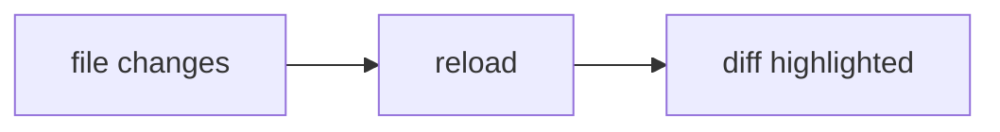
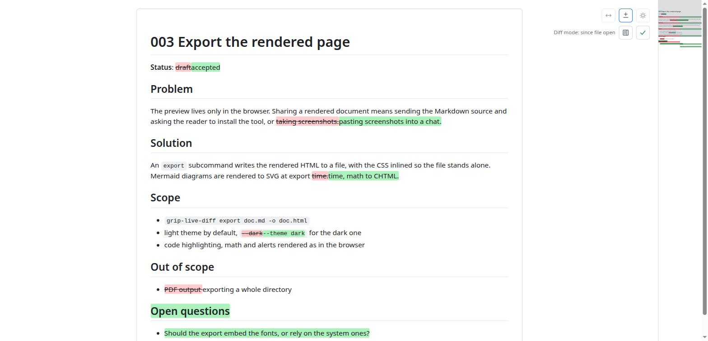

<!-- PROJECT LOGO -->
<br />
<div align="center">
  <a href="#">
    
  </a>

  <h3 align="center">grip-live-diff</h3>

  <p align="center">
    Preview Markdown with GitHub's look, and see what changed since you last looked.
  </p>
</div>

## What it is

`grip-live-diff` is a single Go binary that renders a Markdown file in your browser the way GitHub
would, reloads the page whenever the file changes on disk, and highlights what changed, word by word,
inside the rendered document.

It started as a fork of [go-grip](https://github.com/chrishrb/go-grip) by Christoph Herb, a Go
reimplementation of [grip](https://github.com/joeyespo/grip) that renders offline instead of calling
GitHub's API. The rendering engine is still go-grip's. What this fork adds is everything around
*reading a document while something else is writing it*: an editor, a teammate, or an AI agent rewriting
a spec in place. After an auto-reload the page just looks different and you have to re-read it all to
find the delta. This tool shows the delta.

## Install

```bash
go install github.com/babs/grip-live-diff@latest
```

Prebuilt binaries for Linux, macOS and Windows, amd64 and arm64, plus 386 on Linux and Windows, are on the
[releases page](https://github.com/babs/grip-live-diff/releases), as `.xz` archives (`.zip` too on Windows) plus a
`grip-live-diff.sha256sum`. A release binary updates itself in place, after checking the published
checksum:

```bash
grip-live-diff update
```

## Usage

```bash
grip-live-diff README.md   # render one file
grip-live-diff             # README.md of the current directory, or a file listing if there is none
```

The browser opens on http://localhost:6419. The server watches the file's directory, so any `.md`
under it is served as well, at its own path.

| Flag                  | Default     | Effect                                                             |
| --------------------- | ----------- | ------------------------------------------------------------------ |
| `-p`, `--port`        | `6419`      | Port to listen on                                                  |
| `-b`, `--browser`     | `true`      | Open a browser tab on start (`-b=false` to disable)                |
| `--no-reload`         | `false`     | Do not push a reload to the browser when the file changes          |
| `-H`, `--host`        | `localhost` | Host used in the printed and opened URL (the server binds all interfaces) |
| `--bounding-box`      | `true`      | Draw the GitHub-style box around the document                      |
| `--version`           |             | Print version and commit                                           |

The page title comes from the file name (`my-guide_v2.md` becomes `My Guide V2`). `Ctrl-C` stops the
server.

## Seeing what changed

The `±` button in the toolbar switches the diff on and off (key `d`). It carries a dot as soon as the
file on disk differs from the version you opened, so a reload tells you *something* moved even before
you look. With the diff on, a second row picks the reference, one click each:

- **since open** (`?diff=open`, key `1`), everything that changed since you opened the file;
- **last edit** (`?diff=last`, key `2`), only what the most recent save brought;
- **HEAD** (`?diff=head`, key `3`), everything not committed yet, against `git HEAD`. Greyed out
  when the file is not served from a git work tree; a file that has never been committed says so
  instead of showing the whole document as new.

Switching the diff back on returns to the reference you used last.

Insertions are green, removals are struck through in red, and the comparison is done on words, not
lines, so re-wrapping a paragraph is not a change. Inside a code block indentation still counts. The
diff survives the auto-reload, so the highlights refresh on every save.

**Mark as read** takes the current disk content as the new reference for *since open* and *last edit*.
It is greyed out against `HEAD`, which is git's to move, and when there is nothing new. The scroll
position is kept.

### Minimap

While a diff is on, a minimap of the whole document runs along the right edge, VS Code style: a scaled
rendering with every insertion and removal marked in green and red, and a box for the part on screen.
Click it to jump, drag the box to scroll. On a long document the minimap slides with the page so the
current position stays visible. The button next to *Mark as read* hides it.

## Annotating for an agent

When the thing rewriting the file is an agent, the feedback loop has a gap: you read the preview, spot
a sentence to rework, then describe *where* it is in the chat. Annotations close it. Turn capture on
with the pencil button, select text, click **Annotate** (or press `a`) and type what should change.
The passage is marked Confluence-style, a yellow tint with an orange underline, and the comment is
saved next to the file as `<name>.annotations.json5`:

```json5
// grip-live-diff annotations for README.md. JSON5: comments and trailing commas are fine.
// ... how to take part, what not to touch, the entry format ...
{
  "version": 1,
  "file": "README.md",
  "annotations": [
    {
      "id": "k3f9x2",
      "exact": "the quick brown fox",
      "prefix": "e sentence before it ends with ",
      "suffix": " jumps over the lazy dog. Then",
      "lines": [42, 42],
      "comment": "Too informal, rephrase.",
      "created": "2026-09-05T11:52:03+02:00",
      "updated": null,
      "file_hash": "sha256:3b2f…"
    }
  ]
}
```

Then hand the file to the agent: *"handle the comments in README.annotations.json5"*. The header of
the file tells it the rules: take an `flock` on the file while editing it; once a request is handled,
set `status: "done"` with a short `reply`, or delete the entry; when it rewrites an annotated passage,
put the new wording in `exact` so the mark follows; `id`, `created`, `file_hash` and `comment` are
the reader's and must not change. `lines` is a hint into the markdown source, recomputed at every save
from the browser, so `exact` is the truth. A comment with `exact: null` is about the whole document
(the document button, or `A`).

Marks are drawn whenever the file has annotations, capture on or off. Hovering one shows the comment
and the agent's reply; clicking it opens the comment to edit or delete. The row under the toolbar walks
through them, `n` and `p` do the same: document-level comments first, then in document order, then
the ones whose text is gone from the file. Each comment box says which version of the file it was
written against and whether the file changed since; a passage that was reworded is re-anchored on its
surroundings and drawn with a dashed underline, a passage that disappeared with its surroundings is
kept in the file and reachable last. An entry answered by the agent turns grey and shows the reply.

The marks are also listed at the foot of the document, in the same order; hovering an item lights its
mark, clicking it opens the comment. Saving writes the sidecar without reloading the page. Marks need the CSS Custom Highlight API (Chrome 105, Firefox 140, Safari 17.2); older
browsers keep the file but draw nothing.

## Toolbar

| Button | Does                                                                              |
| ------ | --------------------------------------------------------------------------------- |
| `↔`    | Page width: **normal** (GitHub's 896px), **wide** (1400px), **full** (no limit)   |
| `±`    | Diff on/off, see above                                                            |
| theme  | Light or dark                                                                     |
| pencil | Annotation capture on/off, see above                                              |

Keys: `d` toggles the diff, `1` `2` `3` pick the reference, `n` `p` walk the annotations, `a`
annotates the selection, `A` comments on the whole document, `Esc` closes a comment box, `Ctrl-Enter`
saves it.

Width, theme, minimap visibility, annotation capture and the last diff reference are kept in
`localStorage`, so they
survive restarts. The open/closed state of `<details>` blocks and the scroll position survive a
reload, per tab.

## Rendering

Inherited from go-grip, so the output matches GitHub for the things that matter:

- GitHub Flavored Markdown with tables, task lists and footnotes
- syntax highlighting with a copy button on every code block
- GitHub emojis (`:+1:`) and `#hashtags` styled like GitHub
- issue and PR references (`grafana/grafana#22`) linked to GitHub
- mermaid diagrams, with zoom
- math, inline (`$...$`), block (`$$...$$`) and in `math` code fences
- alerts (`> [!NOTE]`, `[!TIP]`, `[!IMPORTANT]`, `[!WARNING]`, `[!CAUTION]`)
- YAML frontmatter rendered as a table
- a print stylesheet

Open this README in the tool to see three of them:



$$\left( \sum_{k=1}^n a_k b_k \right)^2 \leq \left( \sum_{k=1}^n a_k^2 \right) \left( \sum_{k=1}^n b_k^2 \right)$$

> [!TIP]
> Set `?diff=head` in the URL to review your uncommitted edits to a document before committing.



## Development

Tooling is pinned in `mise.toml` (Go, golangci-lint, prek):

```bash
mise run build   # -> bin/grip-live-diff
mise run test
mise run lint
```

Features start as a spec in [`specs/`](specs/README.md) before any code. `release.sh` builds the
release matrix and the checksum file; the `Build and release` workflow runs it on every `v*` tag.

## Lineage

- [grip](https://github.com/joeyespo/grip) by Joe Esposito: the original, Python, rendering through
  GitHub's API.
- [go-grip](https://github.com/chrishrb/go-grip) by Christoph Herb: the offline Go rewrite this
  project forks. Rendering, theming, mermaid, math and emoji support are his work.
- grip-live-diff: the live diff, minimap, inline annotations for an agent, width toggle, git `HEAD`
  comparison and self-update.

MIT, see [LICENSE](LICENSE).
