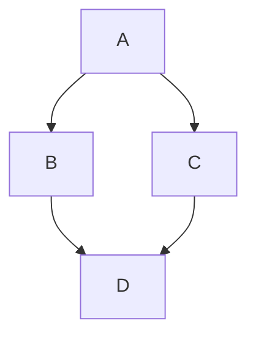

<!-- PROJECT LOGO -->
<br />
<div align="center">
  <a href="#">
    
  </a>

  <h3 align="center">grip-live-diff</h3>

  <p align="center">
    Render your markdown files local<br>- with the look of GitHub
  </p>
</div>

## Table of Contents

- [About](#question-about)
- [Features](#zap-features)
- [Getting started](#rocket-getting-started)
- [Usage](#hammer-usage)
- [Examples](#pencil-examples)
- [Known TODOs / Bugs](#bug-known-todos--bugs)
- [Similar tools](#pushpin-similar-tools)
- [Credits](#heart-credits)

## :question: About

**grip-live-diff** is a lightweight, Go-based tool designed to render Markdown files locally, replicating GitHub's style. It offers features like syntax highlighting, dark mode, and support for mermaid diagrams, providing a seamless and visually consistent way to preview Markdown files in your browser.

This project is a fork of [go-grip](https://github.com/chrishrb/go-grip) by Christoph Herb — itself a reimplementation of the original Python-based [grip](https://github.com/joeyespo/grip), which uses GitHub's web API for rendering. By eliminating the reliance on external APIs, grip-live-diff delivers similar functionality while being fully self-contained, faster, and more secure - perfect for offline use or privacy-conscious users.

The fork adds live word-by-word highlighting of what changed on disk since the file was opened, page-width toggling, and built-in self-update.

## :zap: Features

- :zap: Written in Go :+1:
- 📄 Render markdown to HTML and view it in your browser
- 📱 Dark and light theme
- 🎨 Syntax highlighting for code
- [x] Todo list like the one on GitHub
- Support for github markdown emojis :+1:
- Support for mermaid diagrams
- hashtag linking in page (see table of contents)
- math expressions (code, inline, block)
- gh issues and prs #46 and grafana/grafana#22
- toggle state is preserved in [localStorage](https://developer.mozilla.org/en-US/docs/Web/API/Window/localStorage)
- highlight what changed on disk since the file was opened, down to the word
- three page widths — normal, wide, full — switched from the `↔` button

This is an inline $\sqrt{3x-1}+(1+x)^2$ function.

$$\left( \sum_{k=1}^n a_k b_k \right)^2 \leq \left( \sum_{k=1}^n a_k^2 \right) \left( \sum_{k=1}^n b_k^2 \right)$$

```math
\left( \sum_{k=1}^n a_k b_k \right)^2 \leq \left( \sum_{k=1}^n a_k^2 \right) \left( \sum_{k=1}^n b_k^2 \right)
```



```go
package main

import "github.com/babs/grip-live-diff/cmd"

func main() {
	fmt.Sprintln("Welcome to Grip! Use `grip-live-diff --help` for more information.")
}
```

> [!TIP]
> Support of blockquotes (note, tip, important, warning and caution) [see here](https://github.com/orgs/community/discussions/16925)

> [!IMPORTANT]
>
> test

## :rocket: Getting started

To install grip-live-diff, simply:

```bash
go install github.com/babs/grip-live-diff@latest
```

> [!TIP]
> You can also use nix flakes to install this plugin.
> More useful information [here](https://nixos.wiki/wiki/Flakes).

Release binaries are available on the [releases page](https://github.com/babs/grip-live-diff/releases). An installed release binary can update itself in place:

```bash
grip-live-diff update
```

## :hammer: Usage

To render the `README.md` file simply execute:

```bash
grip-live-diff README.md
# or
grip-live-diff
```

The browser will automatically open on http://localhost:6419. You can disable this behaviour with the `-b=false` option.

You can also specify a port:

```bash
grip-live-diff -p 80 README.md
```

or just open a file-tree with all available files in the current directory:

```bash
grip-live-diff -r=false
```

It's also possible to activate the darkmode:

```bash
grip-live-diff -d .
```

To disable automatic browser reload on file changes (useful for stable editing):

```bash
grip-live-diff --no-reload README.md
```

The browser page title is derived from the Markdown filename (`my-guide_v2.md` becomes `My Guide V2`).

### Seeing what changed

The `±` button next to the theme switch shows what moved on disk since the file was opened. While the
diff is off it carries a dot whenever the file differs from the version you opened; once a diff is on it
is highlighted instead. Clicking it cycles through four states:

1. off — the document as it is now;
2. **since open** (`?diff=open`) — every change since you opened the file;
3. **last edit** (`?diff=last`) — only the change brought by the most recent save;
4. **last commit** (`?diff=head`) — everything not committed yet, compared against `git HEAD`.
   This state only appears when the file is served from a git work tree; a file that has never been
   committed says so instead of showing the whole document as new.

Changes are highlighted inside the rendered document, word by word: insertions in green, removals struck
through in red. Diff mode survives the auto-reload, so the highlights refresh on every save. **Mark as
read** takes the version currently on disk as the new comparison point (it is not offered against
`HEAD`, which is git's to move).

### Page width

The `↔` button cycles the page width through **normal** (GitHub's 896px), **wide** (1400px) and
**full** (no limit). The choice is kept in localStorage, like the theme.

To terminate the current server simply press `CTRL-C`.

## :pencil: Examples


## :bug: Known TODOs / Bugs

- [ ] Make it possible to export the generated html

## :pushpin: Similar tools

This tool is a Go-based reimplementation of the original [grip](https://github.com/joeyespo/grip), offering the same functionality without relying on GitHub's web API.

## :heart: Credits

Original work by [Christoph Herb](https://github.com/chrishrb/go-grip).
